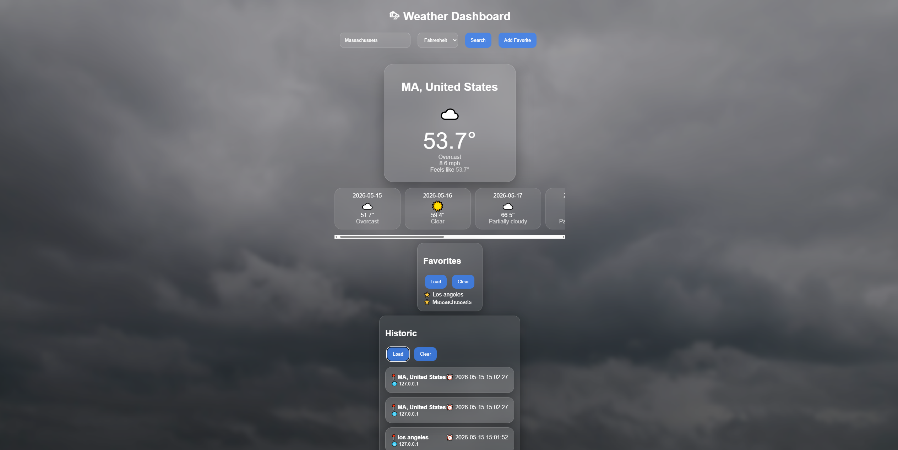
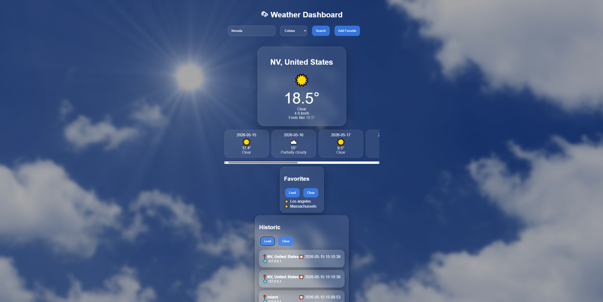

# 🌦 Weather Dashboard

A modern weather dashboard built with **FastAPI (Python)** and **JavaScript**.  
It provides real-time weather data, forecasts, favorites management, and search history using the **Visual Crossing Weather API**.  
(project from roadmap.sh: https://roadmap.sh/projects/weather-api-wrapper-service)

---

## 🚀 Features

- Current weather conditions
- 7-day weather forecast
- Dynamic weather backgrounds and icons
- Favorites system
- Search history tracking
- Redis caching for API optimization
- Rate limiting support
- Responsive glassmorphism UI
- Supports Fahrenheit and Celsius units

---

## 📸 Preview

### Main Section





---

## 🛠️ Tech Stack

- **Backend:** Python + FastAPI
- **Frontend:** HTML, CSS, JavaScript
- **Templating:** Jinja2
- **Cache / Rate Limiting:** Redis
- **Weather API:** Visual Crossing Weather API

---

## 📦 Installation

Clone the repository:

```bash
git clone https://github.com/henriquefrassetto/python-learning-projects.git
cd python-learning-projects/WeatherDashboard
```

Create and activate a virtual environment:

```bash
python -m venv .venv
.venv\Scripts\activate  # Windows
```

Install dependencies:

```bash
pip install -r requirements.txt
```

---

## 📄 requirements.txt

```txt
fastapi
uvicorn
requests
python-dotenv
redis
jinja2
```

---

## ⚙️ Environment Variables

Create a `.env` file in the project root:

```env
API_KEY=your_api_key
WEATHER_API_KEY=your_visualcrossing_key
```

---

## ▶️ Running the App

Start Redis:

```bash
redis-server
```

Start the FastAPI server:

```bash
uvicorn main:app --reload
```

Then open your browser:

```text
http://127.0.0.1:8000
```

---

## 📡 API Endpoints

### Current Weather

```text
/weather/current?city=London&unit=metric
```

### Weather Forecast

```text
/weather/forecast?city=London&unit=metric
```

### Favorites

```text
POST /favorites?city=London
GET /favorites
DELETE /favorites?city=London
```

### Historic

```text
GET /historic
DELETE /historic
```

---

## 🧠 How It Works

- The frontend sends requests using `fetch()`
- FastAPI processes requests and communicates with the Visual Crossing API
- Redis caches responses for 5 minutes
- The UI dynamically updates based on weather conditions
